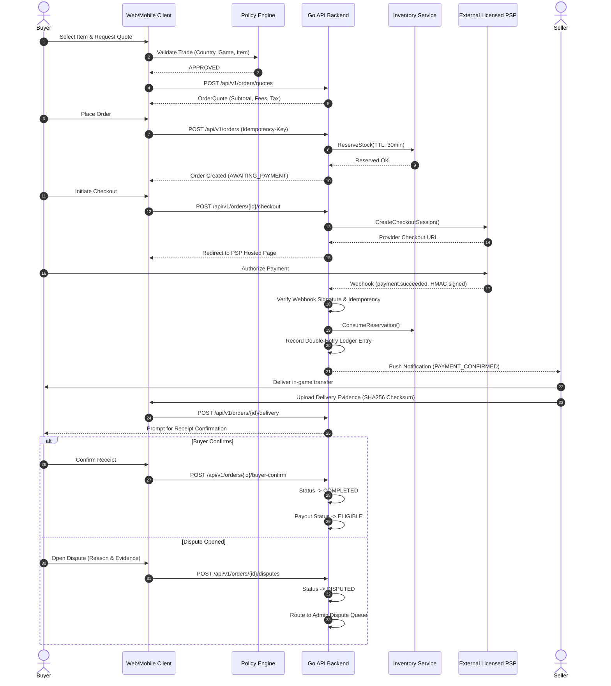

# 08. USER FLOWS & INTERACTION DESIGN

**Document ID:** BN-DOC-008  
**Ref:** Master PO Execution Order BN-GAMEEX-MASTER-001 (Article 15, 17, 18)  

---

## 1. Complete Buyer-to-Seller Order Flow

```mermaid
sequenceDiagram
    autonumber
    actor Buyer
    participant Client as Web/Mobile Client
    participant Policy as Policy Engine
    participant API as Go API Backend
    participant Inv as Inventory Service
    participant PSP as External Licensed PSP
    actor Seller

    Buyer->>Client: Select Item & Request Quote
    Client->>Policy: Validate Trade (Country, Game, Item)
    Policy-->>Client: APPROVED
    Client->>API: POST /api/v1/orders/quotes
    API-->>Client: OrderQuote (Subtotal, Fees, Tax)
    Buyer->>Client: Place Order
    Client->>API: POST /api/v1/orders (Idempotency-Key)
    API->>Inv: ReserveStock(TTL: 30min)
    Inv-->>API: Reserved OK
    API-->>Client: Order Created (AWAITING_PAYMENT)
    
    Buyer->>Client: Initiate Checkout
    Client->>API: POST /api/v1/orders/{id}/checkout
    API->>PSP: CreateCheckoutSession()
    PSP-->>API: Provider Checkout URL
    API-->>Client: Redirect to PSP Hosted Page
    Buyer->>PSP: Authorize Payment
    
    PSP-->>API: Webhook (payment.succeeded, HMAC signed)
    API->>API: Verify Webhook Signature & Idempotency
    API->>Inv: ConsumeReservation()
    API->>API: Record Double-Entry Ledger Entry
    API-->>Seller: Push Notification (PAYMENT_CONFIRMED)
    
    Seller->>Buyer: Deliver in-game transfer
    Seller->>Client: Upload Delivery Evidence (SHA256 Checksum)
    Client->>API: POST /api/v1/orders/{id}/delivery
    API-->>Buyer: Prompt for Receipt Confirmation
    
    alt Buyer Confirms
        Buyer->>Client: Confirm Receipt
        Client->>API: POST /api/v1/orders/{id}/buyer-confirm
        API->>API: Status -> COMPLETED
        API->>API: Payout Status -> ELIGIBLE
    else Dispute Opened
        Buyer->>Client: Open Dispute (Reason & Evidence)
        Client->>API: POST /api/v1/orders/{id}/disputes
        API->>API: Status -> DISPUTED
        API->>API: Route to Admin Dispute Queue
    end
```

