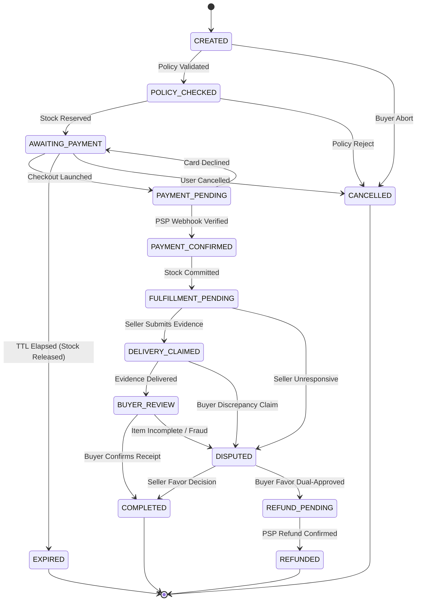

# 19. ORDER LIFECYCLE STATE MACHINE

**Document ID:** BN-DOC-019  
**Ref:** Master PO Execution Order BN-GAMEEX-MASTER-001 (Article 15)  

---

## 1. Deterministic State Transitions

```mermaid
stateDiagram-v2
    [*] --> CREATED
    CREATED --> POLICY_CHECKED: Policy Validated
    CREATED --> CANCELLED: Buyer Abort
    
    POLICY_CHECKED --> AWAITING_PAYMENT: Stock Reserved
    POLICY_CHECKED --> CANCELLED: Policy Reject
    
    AWAITING_PAYMENT --> PAYMENT_PENDING: Checkout Launched
    AWAITING_PAYMENT --> EXPIRED: TTL Elapsed (Stock Released)
    AWAITING_PAYMENT --> CANCELLED: User Cancelled
    
    PAYMENT_PENDING --> PAYMENT_CONFIRMED: PSP Webhook Verified
    PAYMENT_PENDING --> AWAITING_PAYMENT: Card Declined
    
    PAYMENT_CONFIRMED --> FULFILLMENT_PENDING: Stock Committed
    
    FULFILLMENT_PENDING --> DELIVERY_CLAIMED: Seller Submits Evidence
    FULFILLMENT_PENDING --> DISPUTED: Seller Unresponsive
    
    DELIVERY_CLAIMED --> BUYER_REVIEW: Evidence Delivered
    DELIVERY_CLAIMED --> DISPUTED: Buyer Discrepancy Claim
    
    BUYER_REVIEW --> COMPLETED: Buyer Confirms Receipt
    BUYER_REVIEW --> DISPUTED: Item Incomplete / Fraud
    
    DISPUTED --> COMPLETED: Seller Favor Decision
    DISPUTED --> REFUND_PENDING: Buyer Favor Dual-Approved
    
    REFUND_PENDING --> REFUNDED: PSP Refund Confirmed
    
    COMPLETED --> [*]
    REFUNDED --> [*]
    CANCELLED --> [*]
    EXPIRED --> [*]
```

